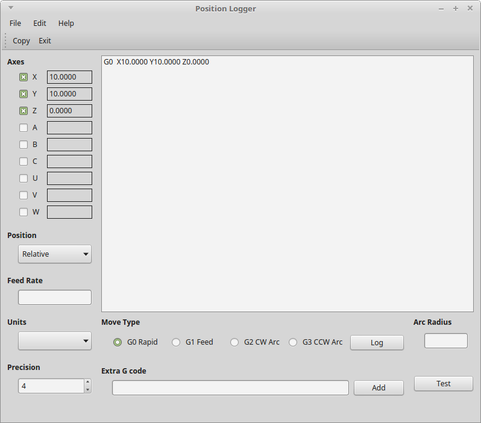

# position-logger
LinuxCNC Position Logger

Old version that uses GTK for the latest version see
[documentation](https://jethornton.github.io/emclog/ 

Generates G code by moving to a point in Axis then record the type of move.

Supports G0 (Rapid), G1 (Feed), G2 (Arc CW), and G3 (Arc CCW)

Requires Python 2.7
Requires PyQt4 sudo apt-get install python-qt4
